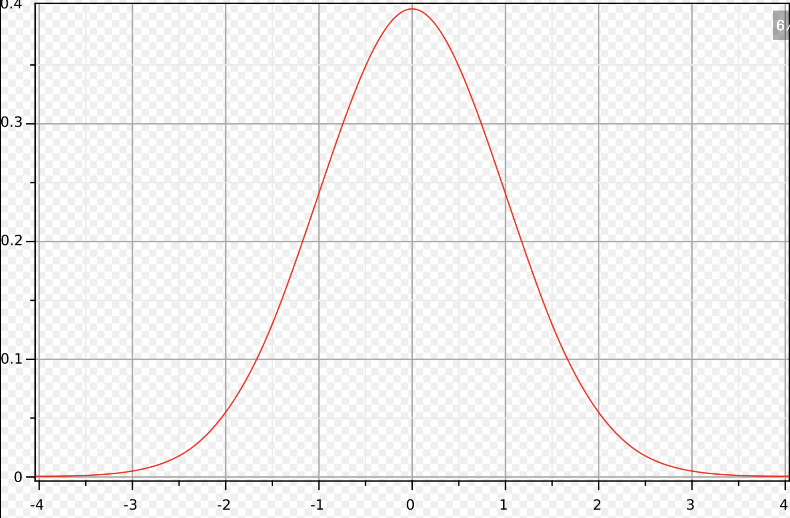

### Cours sur la Loi Normale

#### 1. Introduction à la Loi Normale

La loi normale, également appelée **loi de Gauss** en l'honneur de Carl Friedrich Gauss, est l'une des lois de probabilité les plus utilisées en statistiques et en probabilités. 

>[!NOTE]
>Elle est particulièrement importante car de nombreux phénomènes naturels ou sociaux suivent une distribution qui peut être modélisée par une loi normale.

La loi normale est une distribution continue, ce qui signifie qu'elle est utilisée pour des variables aléatoires qui peuvent prendre une infinité de valeurs dans un intervalle donné.

>[!NOTE]
>Une variable aléatoire est une fonction qui associe un nombre réel à chaque issue d'une expérience aléatoire. 
>Par exemple, le lancer d'un dé peut être modélisé par une variable aléatoire $𝑋$, $X$ prend la valeur 1, 2, 3, 4, 5 ou 6, selon le résultat du lancer.

#### 2. Caractéristiques de la Loi Normale

- **Symétrie** : La courbe de la loi normale est parfaitement symétrique par rapport à sa moyenne. Cela signifie que la probabilité d'obtenir un résultat plus grand ou plus petit que la moyenne est la même.
  
- **Forme de la courbe** : La courbe de la loi normale est en forme de cloche. Elle est connue sous le nom de "courbe de Gauss". 

- **Paramètres** : La loi normale est entièrement définie par deux paramètres :
  - **Moyenne ($\mu$)** : Elle définit le centre de la distribution.
  - **Écart-type ($\sigma$)** : Il détermine la dispersion de la distribution. Un petit écart-type signifie que les valeurs sont concentrées autour de la moyenne, tandis qu'un grand écart-type indique une plus grande dispersion.

  La notation générale d'une variable aléatoire suivant une loi normale est :
  $X \sim N(\mu, \sigma^2)$
  où $\mu$ est la moyenne et $\sigma^2$ est la variance (l'écart-type est $\sigma$).

#### 3. Fonction de Densité de Probabilité

La fonction de densité de probabilité (PDF) d'une loi normale est donnée par la formule :

$f(x) = \frac{1}{\sigma \sqrt{2\pi}} e^{-\frac{(x - \mu)^2}{2\sigma^2}}$

Cette fonction décrit la probabilité de chaque valeur dans la distribution normale. Les éléments de la formule sont les suivants :
- $e$ est la base du logarithme naturel (environ 2,71828...).
- $\pi$ est la constante mathématique pi (environ 3,14159...).
- $\mu$ est la moyenne.
- $\sigma$ est l'écart-type.

#### 4. Propriétés de la Loi Normale

- **Symétrie** : Comme mentionné plus haut, la loi normale est parfaitement symétrique par rapport à sa moyenne $ \mu$.
- **Moyenne, Médiane, Mode** : Dans une loi normale, la moyenne, la médiane et le mode sont tous égaux et se trouvent au même endroit : au centre de la courbe.
- **Asymptotique** : La courbe de la loi normale s'étend à l'infini dans les deux directions (vers $-\infty$ et $+\infty$), mais les probabilités à des valeurs extrêmes deviennent négligeables.
- **68-95-99.7 Rule** : Environ :
  - 68 % des valeurs se situent à une distance de 1 écart-type de la moyenne ($\mu \pm \sigma$).
  - 95 % des valeurs se situent à une distance de 2 écarts-types de la moyenne ($\mu \pm 2\sigma$).
  - 99,7 % des valeurs se situent à une distance de 3 écarts-types de la moyenne ($\mu \pm 3\sigma$).

#### 5. Transformation et Standardisation

La transformation de variables suivant une loi normale est souvent effectuée à l'aide de la **standardisation**. Cela permet de convertir une variable aléatoire suivant une loi normale quelconque $ N(\mu, \sigma^2)$ en une variable suivant une loi normale standard $ N(0, 1)$.

La **standardisation** se fait par la transformation suivante :

$Z = \frac{X - \mu}{\sigma}$

Dans cette formule :
- $Z$ suit une loi normale standard $N(0,1)$ (moyenne 0 et écart-type 1).
- $X$ est une valeur observée de la variable d'origine suivant la loi $N(\mu, \sigma^2)$.

Cela permet d'utiliser les tables de la loi normale standard pour obtenir des probabilités et des quantiles.

#### 6. Calcul des Probabilités

Les probabilités associées à une variable aléatoire suivant une loi normale peuvent être calculées à l'aide de la fonction de distribution cumulée (CDF). Pour une loi normale standard, cette fonction est notée $\Phi(z)$, où $ z$ est la variable standardisée.

Par exemple :
$P(X \leq x) = \Phi\left( \frac{x - \mu}{\sigma} \right)$

Pour des lois normales non standardisées, on effectue d'abord la transformation en $Z$ (comme expliqué précédemment) avant de chercher la probabilité correspondante.

#### 7. Approximation de la Loi Normale

Dans certains cas, les distributions d'échantillons ou des variables aléatoires peuvent ne pas être directement normales, mais la loi normale peut servir d'approximation. Ce principe est à la base du **Théorème Central Limite** (TCL), qui affirme que la somme de variables aléatoires indépendantes, quel que soit leur distribution initiale, tendra vers une loi normale lorsque le nombre de variables augmente.

>[!IMPORTANT]
>Le Théorème Central Limite (TCL) est utilisé pour estimer la distribution d'une moyenne d'échantillons lorsqu'on prélève plusieurs échantillons d'une population, quelle que soit la distribution initiale. Lorsque la taille des échantillons est suffisamment grande (𝑛 ≥ 30), la distribution des moyennes suit une loi normale. 
>
>**Cela permet de calculer des intervalles de confiance et de réaliser des tests d'hypothèses pour la moyenne réelle.**
